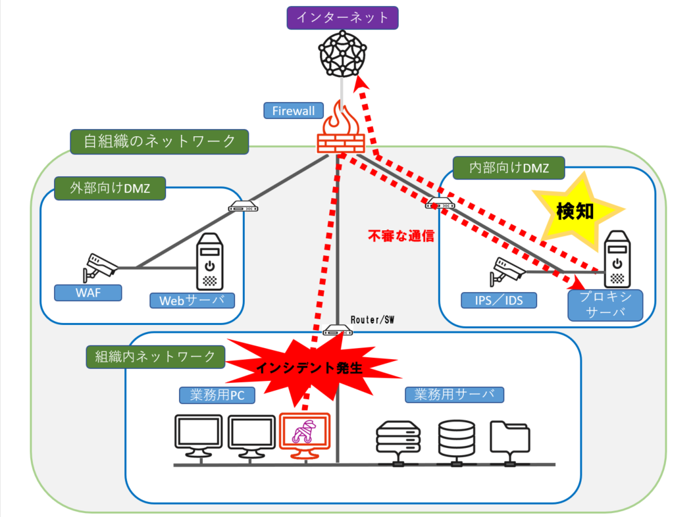
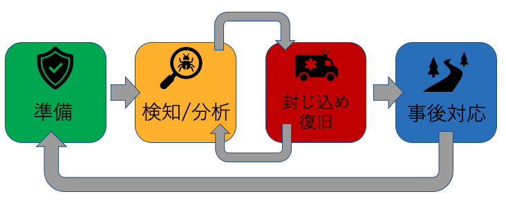

# Module01　インシデント初動対応

## Lecture 1　概論

### インシデントとは
「インシデント（incident）」は、事象や事件、事故と訳されることが多く、自然災害や交通機関の事故やシステム障害などもインシデントと呼ばれています。しかし、本コースにおける定義は、情報システム等の運用におけるセキュリティ上の問題として捉えられる事象を指します。例えば、情報システムからの情報流出や不正アクセス、マルウェア感染を始め、Webサイトの改ざん、DoS攻撃など様々なものが挙げられます。本コースではマルウェアを使用したサイバー攻撃によるインシデントを事例として取り上げ、インシデントレスポンス、つまりインシデントに対する対応手順の説明を進めて行きます。

[*本コースで取り上げるインシデントの事例*]

### インシデントレスポンスとは
インシデントレスポンスの活動は多岐に渡り、組織によって定義や活動範囲も異なります。このモジュールでは、インシデントが発生した際にインシデントによる影響の範囲や原因の特定、被害拡大防止を図るための活動のことを「インシデントレスポンス」と呼ぶこととします。なお、インシデントハンドリングという用語もあり、厳密には両者の定義は異なります。世界の最初のCSIRTである米国CERT/CCが公開している[「CSIRT FREQUENTLY ASKED QUESTIONS (FAQ) 」](https://resources.sei.cmu.edu/asset_files/WhitePaper/2017_019_001_485654.pdf)には、 インシデントハンドリングはインシデントレポーティング、インシデントアナリシス、そしてインシデントレスポンスの３つの機能で構成されていると記述されています。この中でのインシデントレスポンスでは、インシデントの封じ込め、復旧、予防を対象にしているようです。よって、CERT/CCの定義に基づくのであれば、インシデントハンドリングはインシデント対応全体のプロセスを指し、インシデントレスポンスは狭義のインシデント対応を指すことになります。しかし、このモジュールではインシデントレスポンスとインシデントハンドリングは同じ意味として扱います。

### インシデントレスポンスのプロセス
NIST（米国立標準技術研究所）より勧告されている[NIST SP800-61. Revision 2 Computer SecurityIncident Handling Guide](https://nvlpubs.nist.gov/nistpubs/SpecialPublications/NIST.SP.800-61r2.pdf)においては、インシデントレスポンスのプロセスには、「準備」、「検知と分析」、「封じ込め/復旧」、「事後対応」と、大きく４つのフェーズがあるとされています。 

以降では、それら４つのフェーズを簡単にご紹介します。

- 準備
このフェーズでは、インシデントが発生した際の対応能力を確立させておく他に、インシデントが発生しないように予防策を講じることも含まれます。本コースでは、インシデントレスポンスを円滑に行うための策として、インシデントレスポンスに有用なログを取得する仕組みを構築したり、次のフェーズで必要となるツールの準備なども含まれます。また、実際にインシデントレスポンスに当たる要員やそのチーム編成、インシデントレスポンスの手順などもこの準備フェーズにおいて検討すべき事項です。
- 検知と分析
IDS等のセキュリティ機器による検知を始め、サーバの異常動作、もしくは外部からの情報提供など、インシデントの認知のきっかけは様々です。セキュリティ機器の検知であっても必ずしもインシデントによるものではなく、誤検知であるケースも多々あります。インシデントレスポンスに当たる要員は、検知の内容や異常の状態、提供された情報を端緒に分析を行って、それが本当に対応が必要なものなのかといった判断を行う必要があります。
- 封じ込め/復旧
分析結果により対応すべきインシデントと判断された場合、被害が拡大しないようにインシデントの封じ込めを行う必要があります。しかし、この封じ込めについてもインシデントの種類によってとるべき対応は様々です。また、重要になってくるのが、意思決定です。インシデントを封じ込めるために行う内容によっては、システムを停止させたり、機能を無効化したり、または通信を切断したりと、事業継続に影響を及ぼす対応も含まれます。これらの対応の意思決定は、インシデントが発生してから検討するのではなく、予め発生しうるインシデントを想定し、その影響と対応策についても事前に洗い出しを行い、文書化するなどして、いざという時のために備えておくことが重要です。なお、これらの対応策の中には、原因究明や被害状況を把握するためのフォレンジック調査も含まれます。
- 事後対応
事後対応は、インシデント対応で最も大切なフェーズでもあります。その中でも忘れがちなのが、振り返りではないでしょうか。今回起きたインシデントの対応は上手くできたのか？予め準備していた手順書や体制は機能したのかなど、振り返りをしっかり行い、必要に応じて手順書や体制の見直し、ツールや人員の増強などを行います。そして類似のインシデントが再び発生した場合には、前回の対応よりも速やかに上手く立ち回れるようにすることが必要です。